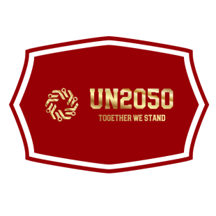
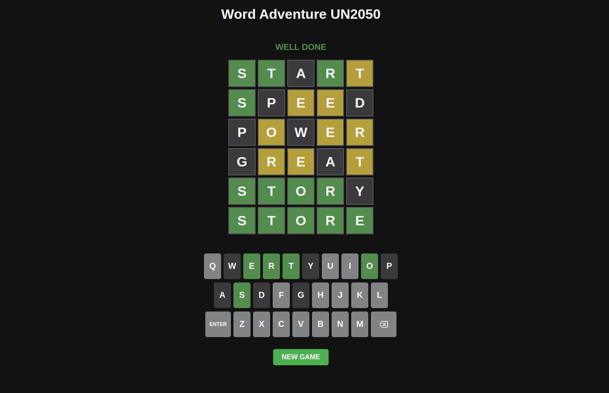
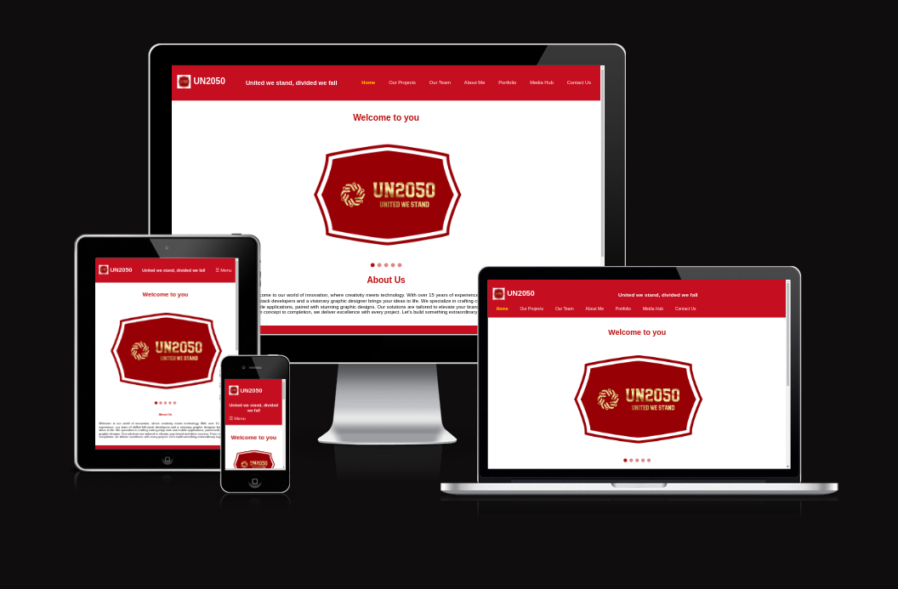
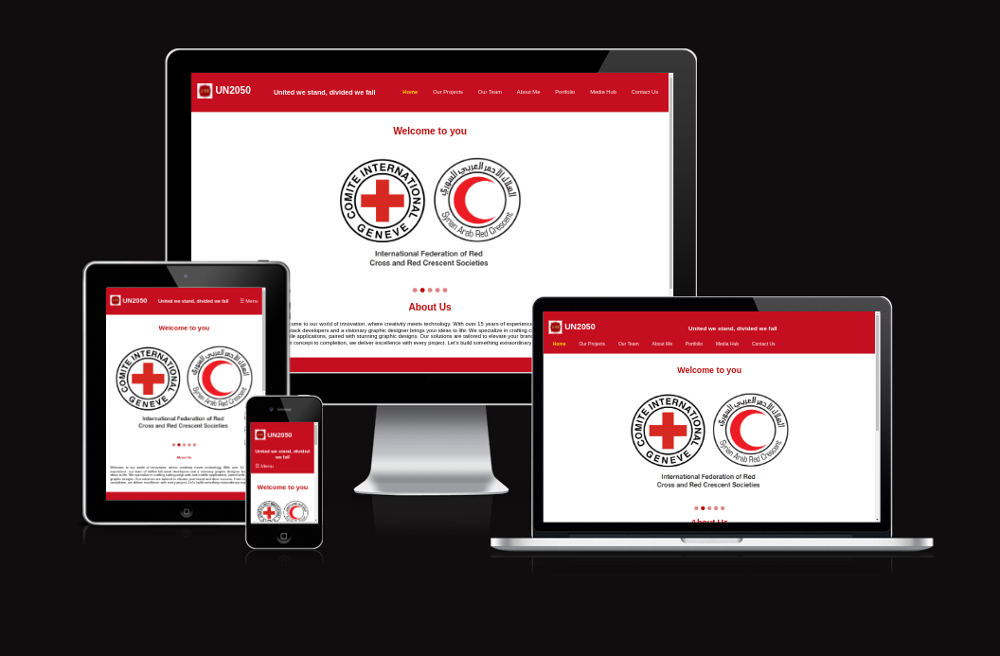

  

---

# **_Word Adventure UN2050 (Think and play rationally forever) - Project Portfolio 2 - JavaScript_**
 
 
**Word Adventure (Inspired by Wordle): A Test of Logic, Language, and Luck**

Much like crosswords, **Word Adventure** (a take on the popular Wordle game) offers players a unique blend of mental challenges and fun. The premise is deceptively simple: guess a hidden five-letter word within six attempts. But beneath that simplicity lies a deeply engaging game of logic, language, and luck.

At its core, **Word Adventure** encourages players to think critically. Each guess provides feedback on which letters are correct and whether they're in the right position. This clue system fosters a problem-solving mindset, where players must adjust their strategy with each guess. It’s an exercise in deductive reasoning, requiring players to continuously refine their approach based on the results of previous guesses. 

Beyond its mental stimulation, **Word Adventure** also serves as a rich vocabulary-building tool. The game pushes players to think of various words and letter combinations, reinforcing their lexicon while exposing them to new possibilities. The challenge of fitting the right word into the pattern becomes a puzzle that tickles linguistic creativity.

Moreover, the game’s daily format (or in this case, any time the player starts a new mission) adds an element of anticipation and motivation. The knowledge that there's always another word to uncover keeps players coming back, driven by both the joy of discovery and the desire to improve. Whether it's the satisfaction of solving the puzzle on the first try or the tension of the final guess, **Word Adventure** provides a delightful balance between challenge and entertainment.

In conclusion, **Word Adventure** is more than just a game. It's a test of your problem-solving skills, an opportunity to expand your vocabulary, and a chance to experience the thrill of cracking the code. The game’s charm lies in its ability to make players feel both smart and entertained, all while subtly sharpening their cognitive abilities.

You can view the live site here - <a href="https://un2050.com/" target="_blank">Word Adventure UN2050</a>

---

---

# React + Vite

This template provides a minimal setup to get React working in Vite with HMR and some ESLint rules.

Currently, two official plugins are available:

- [@vitejs/plugin-react](https://github.com/vitejs/vite-plugin-react/blob/main/packages/plugin-react/README.md) uses [Babel](https://babeljs.io/) for Fast Refresh
- [@vitejs/plugin-react-swc](https://github.com/vitejs/vite-plugin-react-swc) uses [SWC](https://swc.rs/) for Fast Refresh
