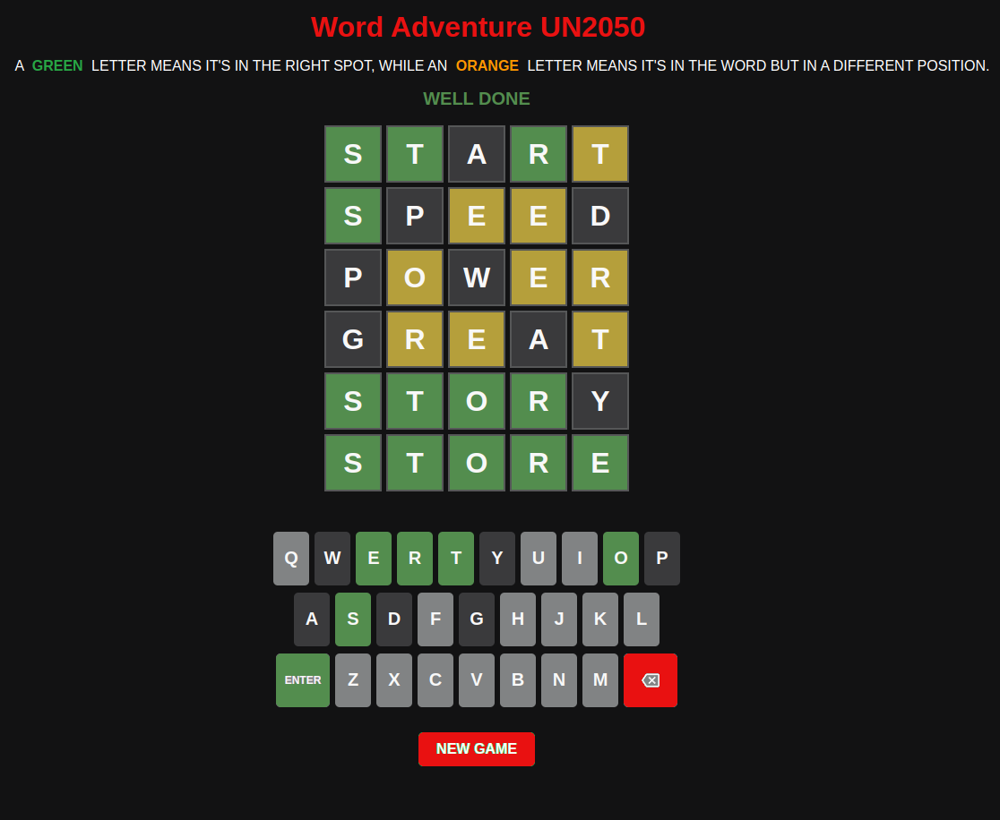

  

---
  

  

---
 

  <a href="https://un2050.com/WordsAdventure"><h1 style="color: #E91111">      <strong>Word Adventure UN2050 (Think and play rationally forever)</strong> - Project Portfolio 2 - JS</h1>
  </a>

 
 
# **_Word Adventure (Inspired by Wordle): A Test of Logic, Language, and Luck_**
Much like crosswords, **Word Adventure** (a take on the popular Wordle game) offers players a unique blend of mental challenges and fun. The premise is deceptively simple: guess a hidden five-letter word within six attempts. But beneath that simplicity lies a deeply engaging game of logic, language, and luck.

At its core, **Word Adventure** encourages players to think critically. Each guess provides feedback on which letters are correct and whether they're in the right position. This clue system fosters a problem-solving mindset, where players must adjust their strategy with each guess. It’s an exercise in deductive reasoning, requiring players to continuously refine their approach based on the results of previous guesses. 

Beyond its mental stimulation, **Word Adventure** also serves as a rich vocabulary-building tool. The game pushes players to think of various words and letter combinations, reinforcing their lexicon while exposing them to new possibilities. The challenge of fitting the right word into the pattern becomes a puzzle that tickles linguistic creativity.

Moreover, the game’s daily format (or in this case, any time the player starts a new mission) adds an element of anticipation and motivation. The knowledge that there's always another word to uncover keeps players coming back, driven by both the joy of discovery and the desire to improve. Whether it's the satisfaction of solving the puzzle on the first try or the tension of the final guess, **Word Adventure** provides a delightful balance between challenge and entertainment.

In conclusion, **Word Adventure** is more than just a game. It's a test of your problem-solving skills, an opportunity to expand your vocabulary, and a chance to experience the thrill of cracking the code. The game’s charm lies in its ability to make players feel both smart and entertained, all while subtly sharpening their cognitive abilities.

You can view the live site here - <a href="https://un2050.com/" target="_blank">Word Adventure UN2050</a>

---

---

 

# Contents

- [**_Word Adventure (Inspired by Wordle): A Test of Logic, Language, and Luck_**](#word-adventure-inspired-by-wordle-a-test-of-logic-language-and-luck)
- [Contents](#contents)
- [Objective](#objective)
- [User Experience (UX)](#user-experience-ux)
  - [Target Audience](#target-audience)
  - [User Stories](#user-stories)
  - [Site Aims](#site-aims)
  - [Site Structure](#site-structure)
  - [Design Choices](#design-choices)
    - [Colour Scheme](#colour-scheme)
    - [Typography](#typography)
- [Features](#features)
- [React + Vite](#react--vite)

# Objective

The goal of Word Adventure is to offer players a fun yet mentally stimulating word puzzle experience. By challenging players to guess hidden five-letter words with limited attempts, the game fosters a balance of entertainment and intellectual engagement. Our primary objective is to enhance users' vocabulary, critical thinking, and pattern recognition skills, all while delivering a rewarding experience through an intuitive and sleek interface. Whether users are looking for a quick mental break or a daily word challenge, Word Adventure provides a platform that caters to all levels of word enthusiasts. It encourages players to explore the depth of their language knowledge, promoting learning and enjoyment through every guessed word.

[Back to top](<#contents>)

# User Experience (UX)

## Target Audience
 
Word Adventure is designed for a diverse audience that enjoys mental challenges and linguistic exploration. It appeals to crossword enthusiasts of all ages—seasoned wordplay fans seeking daily brain workouts and beginners eager for intellectual discovery. The user-friendly interface ensures accessibility for casual gamers and dedicated solvers alike. With varying difficulty levels, our game invites anyone interested in enhancing vocabulary and problem-solving skills. Whether you’re a crossword connoisseur or a newcomer, Word Adventure offers an engaging platform for all word lovers.

[Back to top](<#contents>)

 

## User Stories

- A user should be able to understand the purpose of **Word Adventure** immediately.
- A user should be able to easily and intuitively navigate the game interface.
- A user should clearly identify the aim of each section within the game.
- A user should easily learn about mental stimulation and motivation.
- A user should feel comfortable using the "solve" feature if they cannot guess the correct word.
- A user should be able to guess a five-letter word within six attempts.
- A user should see visual feedback, with letters highlighted in green (correct position) or orange (incorrect position).
- A user should be able to enter guesses using buttons or a keyboard.
- A user should be able to start a new game with a single click.
- A user should be informed when they have exhausted their six attempts without revealing the correct word.

## Site Aims

1. **Engaging Word Play:** The primary aim of **Word Adventure** is to provide an engaging and enjoyable word puzzle experience, encouraging users to enhance their vocabulary and language skills.

2. **Cognitive Development:** The game aims to stimulate cognitive abilities by challenging players to think critically and recognize patterns as they decipher the hidden words.

3. **User Empowerment:** By offering a user-friendly interface, the game empowers players of all skill levels to engage with word puzzles comfortably and confidently.

4. **Social Interaction:** **Word Adventure** encourages players to share their achievements and experiences, fostering a community of word enthusiasts who can connect over their love of language.

5. **Entertainment and Learning:** While primarily a game, **Word Adventure** seeks to blend entertainment with educational value, making learning new words a fun and rewarding experience.

 
[Back to top](<#contents>)

## Site Structure

 

**Word Adventure** is part of a larger site structure that includes various sections, as seen on the navigation bar:

1. **Home Page:** A welcoming page featuring a general introduction and navigation links.
2. **Words Adventure Page:** The game interface where users can play the Word Adventure game.
   1. **Game Title**: "Word Adventure UN2050" prominently displayed at the top.
   2. **Instructions**: Clearly explains that green letters are in the correct position, while orange letters are correct but in the wrong position.
   3. **Game Grid**: Players attempt to guess a five-letter word in six tries. The grid shows previous guesses with color-coded feedback.
   4. **Keyboard**: Below the grid is an on-screen QWERTY keyboard for input, along with "Enter" and "New Game" buttons for control.
   5. This concise layout emphasizes simplicity and ease of use.
3. **Our Projects, Team, and Portfolio:** These sections provide more information about the development team, projects, and featured work.

The layout is intuitive, with easy access to all sections via the top navigation bar.

[Back to top](<#contents>)

## Design Choices

### Colour Scheme
 

The color scheme of Word Adventure is designed for clarity and user engagement. The interface uses a dark background (#121213) to reduce eye strain and make key elements stand out. Green (#538D4E) highlights correct letters, while orange (#B59F3B) indicates misplaced letters, providing immediate feedback. The New Game and Backspace buttons are highlighted in red (#C50E1F) for visibility, ensuring easy access to these essential controls. The overall color palette creates a visually appealing, focused gameplay experience.

  
  

 

### Typography

The typography of Word Adventure is crafted for simplicity and readability. A clean sans-serif font is used throughout the interface, ensuring a modern and approachable feel. The text appears in contrasting colors—typically light text on a dark background (#121213)—to reduce eye strain and enhance focus. This choice not only supports a smooth gameplay experience but also allows players to focus entirely on guessing the correct word. The well-defined typography aligns with the game’s intuitive and user-friendly design.

[Back to top](<#contents>)

# Features

Welcome to Word Adventure, where every guess brings you closer to victory! The game interface is straightforward and intuitive. The logo is positioned on the top left, linking back to the home page. The main game area invites players to guess five-letter words, offering six tries to find the correct answer. Below the game grid, the on-screen keyboard and controls—including New Game and Backspace buttons—are clearly visible. Whether using a mouse or keyboard, Word Adventure promises a seamless and engaging experience.

# React + Vite

This template provides a minimal setup to get React working in Vite with HMR and some ESLint rules.

Currently, two official plugins are available:

- [@vitejs/plugin-react](https://github.com/vitejs/vite-plugin-react/blob/main/packages/plugin-react/README.md) uses [Babel](https://babeljs.io/) for Fast Refresh
- [@vitejs/plugin-react-swc](https://github.com/vitejs/vite-plugin-react-swc) uses [SWC](https://swc.rs/) for Fast Refresh
