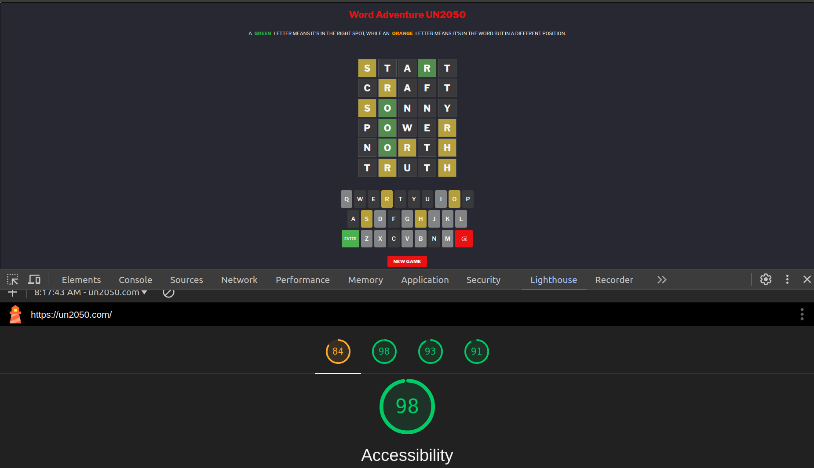

<div align="center">
<a href="https://un2050.com/">
  
  </a>
  </div>

---
  <div>
  <a href="https://un2050.com/WordsAdventure">
  
</a>
</div>


---
 
<div>
  <a href="https://un2050.com/WordsAdventure"><h1 style="color: #E91111">      <strong>Word Adventure UN2050 (Think and play rationally forever)</strong> - Project Portfolio 2 - JS</h1>
  </a>
</div>

 
 
# **_Word Adventure (Inspired by Wordle): A Test of Logic, Language, and Luck_**
Much like crosswords, **Word Adventure** (a take on the popular Wordle game) offers players a unique blend of mental challenges and fun. The premise is deceptively simple: guess a hidden five-letter word within six attempts. But beneath that simplicity lies a deeply engaging game of logic, language, and luck.

At its core, **Word Adventure** encourages players to think critically. Each guess provides feedback on which letters are correct and whether they're in the right position. This clue system fosters a problem-solving mindset, where players must adjust their strategy with each guess. It’s an exercise in deductive reasoning, requiring players to continuously refine their approach based on the results of previous guesses. 

Beyond its mental stimulation, **Word Adventure** also serves as a rich vocabulary-building tool. The game pushes players to think of various words and letter combinations, reinforcing their lexicon while exposing them to new possibilities. The challenge of fitting the right word into the pattern becomes a puzzle that tickles linguistic creativity.

Moreover, the game’s daily format (or in this case, any time the player starts a new mission) adds an element of anticipation and motivation. The knowledge that there's always another word to uncover keeps players coming back, driven by both the joy of discovery and the desire to improve. Whether it's the satisfaction of solving the puzzle on the first try or the tension of the final guess, **Word Adventure** provides a delightful balance between challenge and entertainment.

In conclusion, **Word Adventure** is more than just a game. It's a test of your problem-solving skills, an opportunity to expand your vocabulary, and a chance to experience the thrill of cracking the code. The game’s charm lies in its ability to make players feel both smart and entertained, all while subtly sharpening their cognitive abilities.

You can view the live site here - <a href="https://un2050.com/" target="_blank">Word Adventure UN2050</a>


---


---

 


# Contents

- [**_Word Adventure (Inspired by Wordle): A Test of Logic, Language, and Luck_**](#word-adventure-inspired-by-wordle-a-test-of-logic-language-and-luck)
- [Contents](#contents)
- [Objective](#objective)
- [User Experience (UX)](#user-experience-ux)
  - [Target Audience](#target-audience)
  - [User Stories](#user-stories)
  - [Site Aims](#site-aims)
  - [Site Structure](#site-structure)
  - [Design Choices](#design-choices)
    - [Colour Scheme](#colour-scheme)
    - [Typography](#typography)
- [Features](#features)
  - [Navigation](#navigation)
  - [Home Page](#home-page)
    - [Word Adventure UN2050 Game Page](#word-adventure-un2050-game-page)
    - [Keyboard Section](#keyboard-section)
- [Future Features](#future-features)
  - [Technologies Used](#technologies-used)
- [Testing](#testing)
  - [Code Validation](#code-validation)
  - [Lighthouse Testing](#lighthouse-testing)
  - [Accessibility Testing](#accessibility-testing)
      - [Lighthouse Accessibility Testing](#lighthouse-accessibility-testing)
      - [WAVE Web Accessibility Evaluation Tool](#wave-web-accessibility-evaluation-tool)
      - [Adobe Color Accessibility Tool](#adobe-color-accessibility-tool)
  - [Responsive Testing](#responsive-testing)
      - [The Viewport Resizer](#the-viewport-resizer)
      - [The Responsive Design Checker](#the-responsive-design-checker)
    - [Manual Testing](#manual-testing)
  - [Bugs Fixed](#bugs-fixed)
    - [HTML Validation](#html-validation)
    - [CSS Validation](#css-validation)
      - [Solutions:](#solutions)
    - [Responsiveness](#responsiveness)
    - [Deployment](#deployment)
  - [Credits](#credits)
  - [Tools \& Technologies](#tools--technologies)


# Objective

The goal of Word Adventure is to offer players a fun yet mentally stimulating word puzzle experience. By challenging players to guess hidden five-letter words with limited attempts, the game fosters a balance of entertainment and intellectual engagement. Our primary objective is to enhance users' vocabulary, critical thinking, and pattern recognition skills, all while delivering a rewarding experience through an intuitive and sleek interface. Whether users are looking for a quick mental break or a daily word challenge, Word Adventure provides a platform that caters to all levels of word enthusiasts. It encourages players to explore the depth of their language knowledge, promoting learning and enjoyment through every guessed word.

[Back to top](<#contents>)

# User Experience (UX)

## Target Audience
 
Word Adventure is designed for a diverse audience that enjoys mental challenges and linguistic exploration. It appeals to crossword enthusiasts of all ages—seasoned wordplay fans seeking daily brain workouts and beginners eager for intellectual discovery. The user-friendly interface ensures accessibility for casual gamers and dedicated solvers alike. With varying difficulty levels, our game invites anyone interested in enhancing vocabulary and problem-solving skills. Whether you’re a crossword connoisseur or a newcomer, Word Adventure offers an engaging platform for all word lovers.


[Back to top](<#contents>)


 

## User Stories

- A user should be able to understand the purpose of **Word Adventure** immediately.
- A user should be able to easily and intuitively navigate the game interface.
- A user should clearly identify the aim of each section within the game.
- A user should easily learn about mental stimulation and motivation.
- A user should feel comfortable using the "solve" feature if they cannot guess the correct word.
- A user should be able to guess a five-letter word within six attempts.
- A user should see visual feedback, with letters highlighted in green (correct position) or orange (incorrect position).
- A user should be able to enter guesses using buttons or a keyboard.
- A user should be able to start a new game with a single click.
- A user should be informed when they have exhausted their six attempts without revealing the correct word.

## Site Aims

1. **Engaging Word Play:** The primary aim of **Word Adventure** is to provide an engaging and enjoyable word puzzle experience, encouraging users to enhance their vocabulary and language skills.

2. **Cognitive Development:** The game aims to stimulate cognitive abilities by challenging players to think critically and recognize patterns as they decipher the hidden words.

3. **User Empowerment:** By offering a user-friendly interface, the game empowers players of all skill levels to engage with word puzzles comfortably and confidently.

4. **Social Interaction:** **Word Adventure** encourages players to share their achievements and experiences, fostering a community of word enthusiasts who can connect over their love of language.

5. **Entertainment and Learning:** While primarily a game, **Word Adventure** seeks to blend entertainment with educational value, making learning new words a fun and rewarding experience.

 
[Back to top](<#contents>)

## Site Structure

 

**Word Adventure** is part of a larger site structure that includes various sections, as seen on the navigation bar:

1. **Home Page:** A welcoming page featuring a general introduction and navigation links.
2. **Words Adventure Page:** The game interface where users can play the Word Adventure game.
   1. **Game Title**: "Word Adventure UN2050" prominently displayed at the top.
   2. **Instructions**: Clearly explains that green letters are in the correct position, while orange letters are correct but in the wrong position.
   3. **Game Grid**: Players attempt to guess a five-letter word in six tries. The grid shows previous guesses with color-coded feedback.
   4. **Keyboard**: Below the grid is an on-screen QWERTY keyboard for input, along with "Enter" and "New Game" buttons for control.
   5. This concise layout emphasizes simplicity and ease of use.
3. **Our Projects, Team, and Portfolio:** These sections provide more information about the development team, projects, and featured work.

The layout is intuitive, with easy access to all sections via the top navigation bar.

[Back to top](<#contents>)

## Design Choices

### Colour Scheme
 

The color scheme of Word Adventure is designed for clarity and user engagement. The interface uses a dark background (#121213) to reduce eye strain and make key elements stand out. Green (#538D4E) highlights correct letters, while orange (#B59F3B) indicates misplaced letters, providing immediate feedback. The New Game and Backspace buttons are highlighted in red (#C50E1F) for visibility, ensuring easy access to these essential controls. The overall color palette creates a visually appealing, focused gameplay experience.

[Back to top](<#contents>)

  
  


 
[Back to top](<#contents>)

### Typography


The typography of Word Adventure is crafted for simplicity and readability. A clean sans-serif font is used throughout the interface, ensuring a modern and approachable feel. The text appears in contrasting colors—typically light text on a dark background (#121213)—to reduce eye strain and enhance focus. This choice not only supports a smooth gameplay experience but also allows players to focus entirely on guessing the correct word. The well-defined typography aligns with the game’s intuitive and user-friendly design.

[Back to top](<#contents>)

# Features

Welcome to Word Adventure, where every guess brings you closer to victory! The game interface is straightforward and intuitive. The logo is positioned on the top left, linking back to the home page. The main game area invites players to guess five-letter words, offering six tries to find the correct answer. Below the game grid, the on-screen keyboard and controls—including New Game and Backspace buttons—are clearly visible. Whether using a mouse or keyboard, Word Adventure promises a seamless and engaging experience.

## Navigation
The navigation menu is featured at the top of the page and contains links to the main content sections:
- **Logo:** Centered in the navigation bar, the logo links back to the homepage.
- **Responsive Design:** Three variations of the navigation bar are provided for different screen sizes. Each variation maintains consistent color and design styles, while the structure adapts to ensure a smooth user experience across devices.

 


 


## Home Page


 


 
 


### Word Adventure UN2050 Game Page
 

 


 


 
 


### Keyboard Section


 


[Back to top](<#contents>)


  

# Future Features


1. **Expanded Word Database:** Introduce a more extensive vocabulary database, incorporating a broader range of words, including uncommon and specialized terms. This enhancement will challenge users further and promote vocabulary growth, ensuring players encounter a diverse array of words during gameplay.

2. **Themed Daily Challenges:** Implement daily challenges centered around specific themes, such as historical figures, geography, or science. These challenges will provide players with a unique twist each day, allowing them to learn and explore various topics while playing.

3. **Multiplayer Mode:** Foster a sense of community and competition by incorporating a multiplayer mode. Users can challenge friends or connect with word enthusiasts worldwide, engaging in collaborative word-solving or competing for the fastest completion times. This social feature adds a dynamic and interactive dimension to the game.

4. **Personalized User Profiles and Achievements:** Enhance user engagement by introducing personalized profiles where players can track their progress and achievements. Users can earn badges for completing specific challenges or reaching milestones, adding a gamification element that motivates players to explore and conquer new word puzzles.

5. **Adaptive Difficulty Levels:** Implement an adaptive difficulty system that adjusts the game's challenge based on players’ performance. This feature will ensure that both newcomers and seasoned players have an engaging experience, promoting continuous learning and skill improvement.

6. **Interactive Tutorial and Hints:** Develop an interactive tutorial for new players to quickly grasp the game mechanics and strategies. Additionally, offer hint options for players who may be struggling, helping them learn without sacrificing the challenge of the game.

7. **Global Leaderboards:** Introduce leaderboards to track and showcase players' performance across the community. This feature will encourage friendly competition and allow users to see how they rank against others, fostering a sense of achievement and motivation.
 
 
## Technologies Used

- **HTML5:** Provides the fundamental structure and content for the Word Adventure website.
- **CSS3:** Delivers the styling and layout, ensuring a visually appealing and responsive design for an enhanced user experience.
- **JavaScript (JS):** Implements the game logic, interactivity, and functionality, enabling users to engage with the word puzzle dynamically.
- **[React](https://reactjs.org/):** Utilized for building the user interface, allowing for efficient component-based development and state management.
- **[Vite](https://vitejs.dev/):** A modern frontend build tool used for fast development and optimized production builds, ensuring quick loading times and a smooth user experience.
- **[Adobe XD](https://www.adobe.com/ie/products/xd.html):** Employed to create wireframes and prototypes for the website, facilitating user experience design and testing.
- **[Adobe Illustrator](https://www.adobe.com/ie/products/illustrator.html):** Used for designing the logo and social media assets, enhancing the brand identity of Word Adventure.
- **[Adobe Photoshop](https://www.adobe.com/ie/products/photoshop.html):** Utilized to resize images and export them as progressive JPEG files for optimal web performance.
- **[Adobe Color](https://color.adobe.com/create/color-contrast-analyzer):** Applied to test color contrast and ensure accessibility with a color-blind safe palette.
- **[Adobe Lightroom](https://www.adobe.com/ie/products/photoshop-lightroom.html):** Used to optimize and resize images for better visual quality on screens.
- **[I love IMG](https://www.iloveimg.com/de):** A tool used for further compressing optimized images to reduce load times.
- **Visual Studio Code:** The primary code editor used for development, providing a rich environment with extensions for better productivity.
- **Git Bash:** A terminal tool used to manage version control and push changes to the GitHub repository.
- **GitHub:** Utilized for hosting and deploying the website, ensuring version control and collaboration among team members.

 


[Back to top](<#contents>)


 

# Testing

## Code Validation

Word Adventure has been [validated](https://validator.w3.org/services) via [W3C HTML Validator](https://validator.w3.org/) and the [W3C CSS Validator](https://jigsaw.w3.org/css-validator/). There were 2 minor errors that came up for home page. This was immediately corrected and documented down below in [Bugs Fixed](<#bugs-fixed>).


  

**For Styles files.**


 
  
 
  
**For Javascript/JSX files.**


  

## Lighthouse Testing 

The website was also put through Lighthouse testing via Chrome Devtools which tests a site under 4 different headings; Performance, Accessibility, Best Practices and it tests it under mobile and desktop criteria.


## Accessibility Testing 

#### Lighthouse Accessibility Testing 



#### WAVE Web Accessibility Evaluation Tool

[WAVE Web Accessibility Evaluation Tool](https://wave.webaim.org/) was used to check the colour contrast on the website for accessibility purposes which it passed. 


#### Adobe Color Accessibility Tool 

The [Adobe Color Accessibility Tool](https://color.adobe.com/create/color-accessibility) was used also to ensure the color palette met accessibility standards by testing contrast and simulating color blindness. This tool confirmed that the design maintains clarity and readability for users with visual impairments.
 


## Responsive Testing

Responsiveness was tested via a few different mediums manually, including Chrome Devtools, [The Viewport Resizer](https://chrome.google.com/webstore/detail/viewport-resizer-%E2%80%93-respon/kapnjjcfcncngkadhpmijlkblpibdcgm?hl=en) chrome extension and [The Responsive Design Checker](https://responsivedesignchecker.com/) website.

#### The Viewport Resizer


#### The Responsive Design Checker


### Manual Testing

In addition to automated testing, manual testing was performed across key sections of Word Adventure to ensure smooth functionality and a seamless user experience.

- **Home Page**: Verified that all navigation links work correctly, including:
  - [Home](#)
  - [Words Adventure](#)
  - [Our Projects](#)
  - [Our Team](#)
  - [About Me](#)
  - [Portfolio](#)
  - [Media Hub](#)
  - [Contact Us](#)  
  Confirmed that the logo redirects to the homepage.

- **Game Area**: Confirmed that word input, letter coloring (green and orange), and feedback are functioning as expected.

- **Keyboard & Controls**: Tested the on-screen keyboard, including the New Game and Backspace buttons.

- **Game Completion**: Ensured proper display of feedback when all guesses are used.

Each section was checked to ensure flawless operation.

 

## Bugs Fixed

### HTML Validation

There were no HTML erorrs!

### CSS Validation


The following error was presented once the website was placed through CSS HTML Validator.


 


It said that there are 2 errors:
1. Font Loading Error: File not found: https://fonts.googleapis.com/css2?family=Libre+Franklin:wght@800;600: Bad Request

2.  CSS Align-Items Error: .footer-column nav left is not a align-items value: left


#### Solutions:
1. change the font import to: @import url('https://fonts.googleapis.com/css2?family=Libre+Franklin:wght@800;600&display=swap');
2. that error suggests that there's an invalid value assigned to the align-items property in your CSS. The align-items property can only accept certain values such as flex-start, flex-end, center, baseline, or stretch.

```
.footer-column nav {
    align-items: left; /* This is incorrect */
}
```
We Change it to one of the valid values, such as:


```
.footer-column nav {
    align-items: flex-start; /* This is valid */
}
```

 
 

### Responsiveness
 

[Back to top](<#contents>)


 
### Deployment

The website was deployed to GitHub Pages using Yarn and the following steps:

1. Ensure you have the [Yarn package manager](https://yarnpkg.com/getting-started/install) installed on your system.
2. Navigate to your project directory in the terminal.
3. Run the command: 
   ```bash
   yarn build
   ```
   This will create a production-ready version of your application.
4. After building, navigate to the **Settings** tab in your GitHub repository.
5. On the left-hand side, scroll down to the **Pages** section.
6. Under the **Source** dropdown, select the branch called **main** and the folder called **root** (or **docs** if that’s where your build is located).
7. Click **Save**. The page will display the deployed link at the top once saved.
8. It may take a few minutes for the deployment to complete.

[Back to top](<#contents>)


 
## Credits

- Fonts were sourced from [Google Fonts](https://fonts.google.com/).
- Images on the website were sourced from [Pexels](https://www.pexels.com/) and [Unsplash](https://unsplash.com/).
- Images were compressed by [TinyPNG](https://tinypng.com/).
- The color palette was created using [Coolors](https://coolors.co/).
- Flexbox techniques were learned from a video by [LearnWebCode](https://www.youtube.com/watch?v=k32voqQhODc&ab_channel=LearnWebCode).
- CSS Grid was learned through resources from [Traversy Media](https://www.youtube.com/watch?v=jV8B24rSN5o&t=7s&ab_channel=TraversyMedia) and [CSS Tricks](https://css-tricks.com/look-ma-no-media-queries-responsive-layouts-using-css-grid/).
- Code for CSS transform scale properties was derived from [Learn with Param](https://learnwithparam.com/blog/scale-elements-on-hover-using-css/#:~:text=Often%20we%20get%20a%20requirement%20to%20scale%20images,%2F%2F%20shrinking%20in%20size.shrink%3Ahover%20%7B%20transform%3A%20scale%280.8%29%3B%20%7D).
- Techniques for drawing a border inside a shape/image were sourced from [CodeLab](https://www.tutorialrepublic.com/codelab.php?topic=faq&file=draw-border-inside-div-element-with-css).
- Image optimization techniques were learned from [Layout, Flywheel](https://getflywheel.com/layout/optimize-images-for-web/#file-type).
- Some commands and statements were sourced from our course material at Code Institute.
- Content sourced from [wordle-clone](https://github.com/wissamfawaz/wordle-clonem).
- The README template was sourced from [love-running-2.0](https://code-institute-org.github.io//index.html).
- The logo is sourced from [Qonversion](https://qonversion.io/apps/ios/crossword-puzzle-universe/1552720930).

## Tools & Technologies

- **Adobe Creative Suite**: Used for designing graphics, logos, and promotional materials, facilitating a cohesive visual identity.
- **React**: Utilized for building dynamic user interfaces, ensuring efficient component management and interactivity.
- **Vite**: A modern frontend build tool that streamlined development and optimized production builds for faster loading times.
- **Visual Studio Code**: The primary code editor, providing a robust environment for development with extensions to enhance productivity.
- **GitHub**: Used for version control and collaboration, allowing for seamless teamwork and project management.
- **Lighthouse**: Employed for performance and accessibility testing, ensuring a high-quality user experience.

 


 